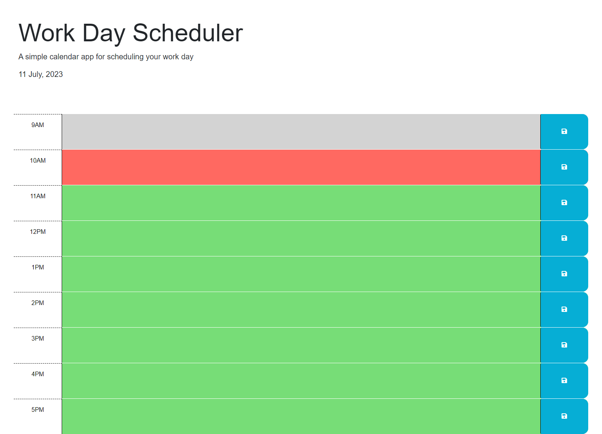

# Time Block Scheduler

This is a time block scheduler application that allows users to manage events and tasks throughout the day. The application provides an interactive interface where users can enter and save their events for different time blocks.

## Screenshot of website

## Deployed site
https://keoughcatelin.github.io/planner/ 

## Technologies Used

- HTML
- CSS
- JavaScript
- jQuery
- Day.js

## Features

- Display the current day at the top of the page.
- Time blocks are color-coded to indicate past, present, and future time slots.
- Users can enter and save events for each time block.
- Saved events persist even after page refresh.

## Usage

The current day will be displayed at the top of the page.
Each time block represents a specific hour of the day.
Enter your event or task in the corresponding time block.
Click the "Save" button to save your event.
The saved event will be stored and displayed even after refreshing the page.

## Development

To run the application locally:

1. Clone this repository.
2. Open the index.html file in your web browser.

## Deployment

The application can be deployed using GitHub Pages or any other hosting service of your choice. Follow these steps to deploy it to GitHub Pages:

1. Create a new repository on GitHub.
2. Push the project files to the repository.
3. In the repository settings, navigate to the "Pages" section.
4. Select the branch you want to deploy (e.g., main) and configure the settings.
5. The application will be deployed and accessible via the provided URL.

## Credits

- [jQuery](https://jquery.com/) - JavaScript library
- [Day.js](https://day.js.org/) - JavaScript date library

## License

This project is licensed under the [MIT License](LICENSE).